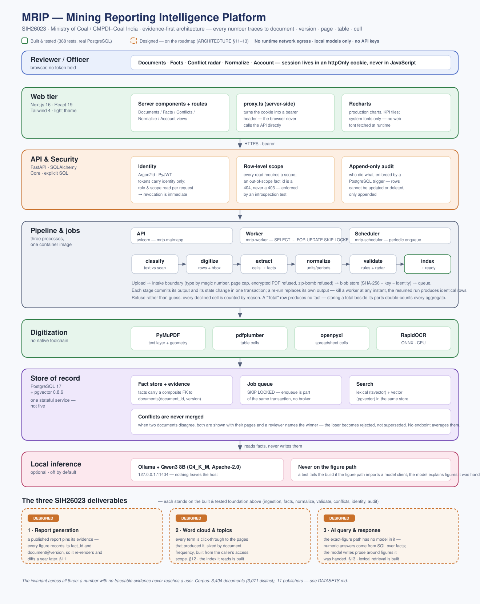
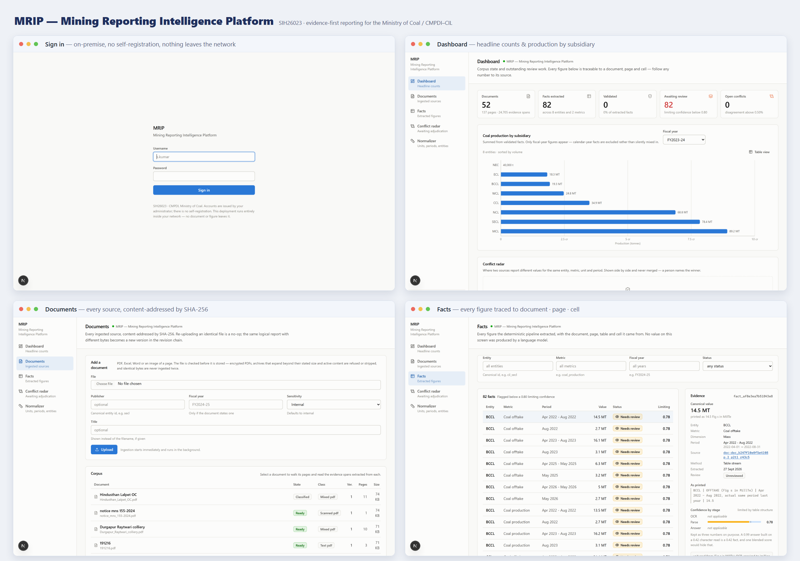

# MRIP — Mining Reporting Intelligence Platform

**SIH26023** · Ministry of Coal / CMPDI–Coal India Limited

> An evidence engine that produces reports — not a mining-themed chatbot.

Every number MRIP shows is a row in a fact store with a pointer back to the document,
version, page, table and cell it came from. The language model never invents a figure;
it explains figures the deterministic layer has already extracted and validated.

**The invariant:** *a number with no traceable evidence never reaches a user.*

Here is what that looks like in practice — a real upload, through the real pipeline:

```
mcl   coal_production  FY2023-24  193,000,000 t  (raw 193.0 Million Tonnes)  p.1 p1t1 r2c1  'MCL | 193.00'
secl  coal_production  FY2024-25  193,000,000 t  (raw 193.0 Million Tonnes)  p.1 p1t1 r1c2  'SECL | 193.00'
```

The canonical value is comparable; the raw value is what the page printed; the locator is
where to look. The "Total" row in that table produced no fact at all, because storing a
total beside its parts double-counts every aggregate computed from it.

---

## The three deliverables SIH26023 asks for

| # | Deliverable | What makes it more than a feature | State |
|---|---|---|---|
| 1 | **Automated Report Generation Platform** | A published report **pins its evidence** — every figure records the `fact_id` and `document@version` behind it, so the same report re-renders a year later and diffs against what the corpus says now | **Built** ([ARCHITECTURE §11](docs/ARCHITECTURE.md)) — manifests persisted, `draft → in_review → approved → published`, `.docx`/`.xlsx`/`.pptx`/Markdown, reproduce-and-diff |
| 2 | **Word Cloud & Topic Identification** | Every term is **click-through to the pages that produced it**, sized by document frequency, and built from the caller's access scope | **Built** (§12) — deterministic TF-IDF with a domain stoplist, scope-aware cloud, term → documents → pages drill-through |
| 3 | **AI-Based Query & Response System** | The **exact-figure path has no model client in it** — questions with a numeric answer are answered by SQL over facts; the model writes prose around figures it was handed and cannot introduce a citation | **Built** (§13) — five intents routed, streaming narrative, structured refusals. Vector half of hybrid retrieval still lexical-only |

Underneath all three is the part that is finished and tested: ingestion, extraction into
evidence-backed facts, normalization, validation, the conflict radar, identity with
row-level scope, and an append-only audit trail.

**What that looks like in practice.** Asked for a SECL production report, the generator
refused to pin the figure — two statements claim 191.5 and 193 Mt and no reviewer had
chosen between them, so the manifest named the field and the download was refused rather
than emitting a blank or a guess. After a reviewer resolved the conflict, the same request
pinned `193,000,000 t` to `p.1 p1t1 r1c2` and rendered in all four formats. That refusal
is the product, not an edge case.

**On the percentages the PS asks for** — report-time reduction, extraction accuracy,
automation rate — this repository publishes none of them yet, and
[ARCHITECTURE §14](docs/ARCHITECTURE.md) says exactly what each one is computed from and
what has to exist first. Real documents are not the shortage — there are
[3,404 of them](#real-documents) — but an accuracy percentage needs documents whose figures
someone has transcribed as ground truth, and one computed without that would measure our
own reading.

---

## Architecture at a glance



> Solid boxes are **built and tested** (672 tests against a real PostgreSQL); dashed boxes
> are **designed** and on the roadmap. The full diagram is
> [`docs/architecture.svg`](docs/architecture.svg).

### Screenshots



Sign-in (on-premise, no self-registration) · the dashboard with headline counts and
production by subsidiary · the document corpus, content-addressed by SHA-256 · and the
facts view, where every figure opens an evidence panel showing the document, page, table
and cell it came from and its confidence decomposed into OCR / parse / answer.

**Documentation for reviewers**

| Document | What it covers |
|---|---|
| [`docs/ARCHITECTURE.md`](docs/ARCHITECTURE.md) | The full design, section by section (§7 figure-path isolation, §11–13 the three deliverables, §14 the metrics) |
| [`docs/ROADMAP.md`](docs/ROADMAP.md) | Phases and the gate each one must pass |
| [`docs/EVALUATION.md`](docs/EVALUATION.md) | A ten-minute walkthrough to a populated system, with demo accounts and what to click |
| [`docs/DATASETS.md`](docs/DATASETS.md) | The eleven publishers, their official source links, and how provenance is recorded and verified |
| [`docs/SIH26023-MRIP-Research-Report.pdf`](docs/SIH26023-MRIP-Research-Report.pdf) | The deep-research and feasibility report behind the design |

---

## What this is built for

An **on-premise, multi-user, audited deployment inside the CMPDI/CIL network**, holding
real unpublished production figures and draft parliamentary answers. That constraint,
not a demo, drives every decision:

- **No hosted inference, and no runtime network egress at all.** Local models only. No
  API key exists to leak or rotate. Even the web fonts are system fonts.
- **Concurrency from the foundation.** PostgreSQL as the system of record, because
  reviewers resolving conflicts while workers write facts is multi-writer traffic.
- **Row-level access scope in the schema.** An SECL officer does not see MCL's
  unpublished figures. Enforced in the repository layer and by an introspection test,
  not by the care of whoever writes the next query.
- **Conflicts are never merged.** When two documents disagree, both are shown with their
  pages and a person names the winner. There is no endpoint that averages them.

See [`docs/ARCHITECTURE.md`](docs/ARCHITECTURE.md) for the full design and
[`docs/ROADMAP.md`](docs/ROADMAP.md) for phases and their gates.

---

## Quick start

> **Reviewing this project?** [`docs/EVALUATION.md`](docs/EVALUATION.md) gets you to a
> populated system in about ten minutes, with demonstration accounts, and says what to
> click to test each claim — including how to try to break them.

**One command, from a fresh clone.** Requires only **Docker**.

```bash
./run.sh
```

On Windows, from PowerShell:

```powershell
.\run.ps1
```

It checks the host, picks free ports if 3000/8000/5432 are taken, builds the images,
waits for the API to answer, seeds a demonstration corpus through the **real** pipeline,
and prints the five accounts to sign in with. Every refusal it can produce names a
remedy, because the failure that costs an hour is the one that does not say which of
Docker, a port, a migration or a missing account went wrong.

```
  Open   http://localhost:3000

  Password   sih-demo-2026-mrip

      USERNAME         ROLE      SEES          WHY YOU'D USE IT
      admin            admin     all entities  Deployment administration, audit log
      hq.officer       officer   all entities  Upload, generate reports, CIL-wide
      secl.officer     officer   secl only     Row-level scope — a shorter document list
      cmpdi.reviewer   reviewer  all entities  Adjudicates conflicting figures
      ministry.viewer  viewer    all entities  Read only — every write is refused
```

Start with `hq.officer`. Signing in as `secl.officer` in a second browser profile shows
the same corpus through one subsidiary's access, which is the access model demonstrated
rather than described.

```bash
./run.sh stop       # stop it, keep the data
./run.sh reset      # destroy the data and start fresh (asks first)
./run.sh logs api   # follow one service
./run.sh status     # what is running, on which ports
```

There is **no default administrator** outside the demonstration seed, because a
well-known first password is the most common way an on-prem system is compromised.
For a real deployment, create the first account on the host:

```bash
mrip-admin create-user admin --role admin --entities '*' --no-force-change
```

**The local model is optional.** Narrative answers and the prose sections of a report use
it; every figure, table, chart, search result and conflict works without it — the
exact-figure path reaches no model at all. To enable it:

```bash
ollama pull qwen3:8b
```

`run.sh` detects it and points the containers at the host runtime. Nothing leaves the
host. With `MRIP_LLM_ENABLED=false` the deterministic paths are unchanged and the
generative ones say so rather than degrading silently — CI runs the suite both ways.

### Running the pieces by hand

For development, where you want a reloading API and the Next dev server:

```bash
cp .env.example .env
docker compose up -d postgres
```

```bash
cd apps/api && python -m pip install -e ".[dev]" && alembic upgrade head
```

```bash
mrip-admin seed-demo
```

Then the three processes — API, worker, scheduler — and the web dev server:

```bash
python -m uvicorn mrip.main:app --reload --port 8000
```

```bash
mrip-worker
```

```bash
mrip-scheduler
```

```bash
cd apps/web && npm install && npm run dev
```

Open <http://localhost:3000>, sign in, and upload a document from the Documents page.
The browser never calls the API directly and never holds a token: the session lives in an
httpOnly cookie, and `apps/web/src/proxy.ts` turns it into a bearer header server-side.

### No Docker? (Windows / WSL2)

Docker Desktop needs an elevated service, which some managed laptops will not start.
The same PostgreSQL 17 + pgvector 0.8.6 runs inside WSL2 with no administrator rights:

```bash
wsl -d Ubuntu -u root -- bash /mnt/c/path/to/repo/infra/wsl-postgres-setup.sh
```

```bash
bash infra/wsl-db-env.sh
```

The second script discovers the distro's address (WSL2 assigns it per boot), keeps the VM
from idling out — which otherwise stops the database and looks exactly like a network
fault — and writes `apps/api/.env`. The test suite reads it from there.

### Tests

```bash
cd apps/api && pytest -q
```

The suite runs against a **real PostgreSQL** (it creates `mrip_test` beside the dev
database), because partial unique indexes, composite foreign keys, `LEAST` ignoring
nulls and the audit log's append-only trigger are not behaviours a stand-in reproduces.
With no database reachable, the database-backed tests skip with an actionable message
and the pure-logic suites still run.

```bash
cd apps/api && ruff check . && mypy mrip
```

```bash
cd apps/web && npx tsc --noEmit && npx eslint . && npx next build
```

---

## How a document becomes a figure

```
upload ──► boundary ──► blob store ──► queue
             │             │
   type by magic number,   SHA-256 of the *sanitized*
   page cap, encrypted     bytes is the key and the
   PDF refused, active     identity: re-uploading the
   content stripped        same file is a no-op
                                   │
   classify ─► digitize ─► extract ─► normalize ─► validate ─► index ─► ready
      │           │           │           │            │          │
   text layer   lines with  table cells  weak figures  domain    facets from
   or scan,     bbox, table  → facts     → review      rules +   the facts
   per page     cells, sheet  via the                  conflict
                cells        normalizers               radar
```

Each stage is a job. Its output and its state change commit in one transaction, and a
re-run replaces its own output rather than appending — so a worker can be killed at any
instant and the resumed run produces identical rows. The queue is
`SELECT … FOR UPDATE SKIP LOCKED` in the same PostgreSQL, which is why there is no broker:
*enqueuing a job is part of the transaction that makes it necessary.*

## Real documents

> Publisher-by-publisher sources, official links and the provenance rules are in
> [`docs/DATASETS.md`](docs/DATASETS.md).

The extractor is developed against documents Coal India actually publishes, not against
tables we invented. `mrip-admin fetch-corpus` crawls the eleven publishers below — one
request per second per host, `robots.txt` obeyed, backing off when a WAF starts serving
CAPTCHAs instead of pages — and files each document under the company it is *about*
rather than the page it was linked from, because CIL's annual-reports page carries every
subsidiary's annual report:

| | files | | files |
|---|---|---|---|
| Western Coalfields | 1,125 | Central Mine Planning & Design Institute | 130 |
| Coal India Limited | 771 | South Eastern Coalfields | 97 |
| Mahanadi Coalfields | 486 | Coal Controller's Organisation | 47 |
| Ministry of Coal | 418 | Central Coalfields | 33 |
| Bharat Coking Coal | 240 | Eastern Coalfields | 29 |
| | | Northern Coalfields | 28 |

**3,404 files, 25.4 GB** — 3,393 PDFs and 11 spreadsheets: monthly production and offtake
statements, provisional coal statistics, annual reports and accounts. They came off 3,404
distinct URLs and are **3,071 distinct documents**, because a subsidiary's annual report is
usually published both on its own site and on `coalindia.in`; the manifest records every
address rather than quietly dropping one, and the intake boundary collapses them on
SHA-256 the same way it collapses a re-upload. The same overlap puts 57 files under two
companies — the copy on `coalindia.in` carries no subsidiary marker in its path, so the
router falls back to the site that linked it. That is a known limit of routing by URL, and
it is counted here rather than hidden.

```bash
mrip-admin fetch-corpus                 # crawl and download, resumable
```

```bash
mrip-admin ingest-corpus --limit 50     # put them through all six stages
```

The documents themselves are **not** in this repository — 25 GB of public PDFs are not
ours to redistribute, and git is the wrong place for them. What *is* committed is
[`data/corpus/manifest.json`](data/corpus/manifest.json): for every file, its publisher,
its title, the **URL it came from**, its SHA-256 and when it was retrieved. That is the
provenance record — it is how you check that these figures came off documents Coal India
published, and it rebuilds the same corpus on another machine. `tests/test_corpus_routing.py`
holds it to its own rules: one publisher name per company, a source URL and a hash on
every entry, and the declared count matching the documents listed.

**What the real corpus changed.** Reading them is not a formality; they broke things that
synthetic tables never would:

- **CIL's monthly statements are scans whose OCR was saved back into the PDF.** They have
  a text layer with true coordinates and untrustworthy glyphs — `63.5` read back as
  `635`. Treating that as "has a text layer" ingests wrong figures; treating it as "no
  text layer" throws away a usable grid. Of the 122 production, offtake and performance
  statements in the corpus, 17 are in this state and 41 more carry no text objects at all.
  The reader now verifies every figure against the page's own printed `% GROWTH` column
  and refuses, per block and per row, what fails — without needing to know the right
  answer. The tests in `tests/test_performance_statement.py` are transcribed cell for
  cell out of two of those documents, OCR wounds included.
- **A figure read off a recognised layer is not as trustworthy as a typeset one, and says
  so.** Its `ocr` confidence carries the rate at which the recogniser reproduced the
  page's own arithmetic — 0.875 on the May 2026 statement, 7 of 8 checkable rows — rather
  than a `None` that would claim the figure was typeset.
- **34,427 of the corpus's 187,424 pages are true scans with no text objects at all.**
  That is 18% of the corpus, and 1,256 of its 3,060 distinct PDFs are scans end to end;
  521 more carry a recognised layer on at least one page. The scans are not read yet —
  recovering them needs OCR-with-geometry, and that is stated as unfinished rather than
  quietly counted as coverage. A further 96 documents defeat the reader outright, one of
  them by segfaulting PyMuPDF rather than raising; because every stage commits its own
  output and a re-run replaces it, that is a document the pipeline reports as failed and
  not a run it corrupts.

## Layout

```
apps/api/                 FastAPI + workers (one image, three entrypoints)
  mrip/
    schemas.py            The domain contract. A Fact cannot exist without evidence.
    normalize/            Units, fiscal periods, CIL entities, metrics — pure, no storage
    ingest/
      intake.py           The upload boundary: refuses with a reason
      digitize.py         Bytes → evidence rows, with page and bounding box
      lifecycle.py        The state machine, as a table of legal transitions
      pipeline.py         One job handler per stage
    facts/extract.py      Table cells → facts, refusing what it cannot resolve
    validate/rules.py     Domain rules that route figures to review, never correct them
    query/                The five intents. exact.py and compare.py reach no model.
    reports/              Templates as data, manifests that pin evidence, four writers
    topics/               Deterministic TF-IDF keyphrases — no model, reproducible
    db/
      tables.py           SQLAlchemy Core schema; the constraints are the argument
      repositories/       One per aggregate, each requiring an access scope
      store.py            Facade over one transaction
    auth/                 Scope, roles, Argon2id passwords, tokens
    jobs/                 Queue, worker, scheduler
    api/                  Routes. Every read is scoped.
    cli.py                mrip-admin: bootstrap and day-to-day operator commands
  migrations/             Alembic, forward-only
apps/web/                 Next.js 16 + React 19 + Tailwind 4, light theme
  src/proxy.ts            Turns the session cookie into a bearer token, server-side
infra/                    WSL2 database setup, for hosts without Docker
docs/                     Architecture and roadmap
```

## Stack

| Layer | Choice | Why |
|---|---|---|
| Store of record | PostgreSQL 17 + pgvector | Also the job queue (`SKIP LOCKED`), lexical search (`tsvector`) and vector search — one stateful service for a government sysadmin to operate, not five |
| API | FastAPI + SQLAlchemy Core | Explicit SQL; an identity map buys nothing for an append-only evidence store |
| Digitization | PyMuPDF · pdfplumber · openpyxl · RapidOCR (ONNX, CPU) | No native toolchain to provision on a locked-down host |
| Identity | Argon2id · PyJWT | Tokens carry identity only; role and scope are read per request, so revocation is immediate |
| Inference | Ollama + **Qwen3 8B** (Q4_K_M, Apache-2.0), local only | Never on the figure path — see ARCHITECTURE §7. 5.2 GB, runs on CPU or a small GPU, which is what a CMPDI host is likely to have |
| Frontend | Next.js 16 · Tailwind 4 · Recharts | Light theme; shadcn-style primitives held in-repo, no component-vendor dependency |

Everything is free and open source. Licences are permissive (MIT / Apache-2.0 / BSD /
PSF) with one recorded LGPL exception (`psycopg`, imported unmodified); AGPL and GPL
fail the build. CI publishes a full licence inventory on every commit.

---

## Current state

**672 tests green in ~70 s** against PostgreSQL 17.11 + pgvector 0.8.6 · ruff and
`mypy --strict` clean across 80 modules · migrations round-trip with zero schema drift ·
the frontend builds and serves end to end.

Working today: identity and row-level scope, the append-only audit trail, the job queue
with its worker and scheduler, the upload boundary, the six-stage ingestion pipeline,
table extraction into evidence-backed facts, the validation rules, the conflict radar,
and the reviewer UI over all of it.

Next, in dependency order: the query and response system (PS deliverable 3), then report
generation (deliverable 1), then the word cloud (deliverable 2) — see
[`docs/ROADMAP.md`](docs/ROADMAP.md), where each phase names the deliverable it serves and
the gate it has to pass.

**What is deliberately absent:** an accuracy number. The extractor is exercised against
3,404 documents Coal India, its subsidiaries, CMPDI, the Coal Controller and the Ministry
of Coal actually published — see [Real documents](#real-documents) below — and the tests
that pin the monthly production statement are transcribed cell for cell out of those
files. But real documents are not the same as *labelled* documents: an accuracy
percentage needs a gold corpus with ground truth (roadmap 3.6), and a percentage computed
without one would be measuring our own transcription. The same honesty applies to the OCR
path: a deployment without the `ocr` extra fails a scanned document loudly rather than
ingesting it empty, and the recognised-text-layer case is now measured — but the 34,427 true-scan pages in the
corpus have not been.

## A note on scope

The seven CIL coal subsidiaries are ECL, BCCL, CCL, NCL, WCL, SECL and MCL, plus CMPDI
and the North Eastern Coalfields unit. **SCCL and NLCIL are not CIL subsidiaries**, and
the entity normalizer says so explicitly rather than resolving them into the group.

---

## Contributors

The six-member team and the part each owns:

| Member | GitHub | Area |
|---|---|---|
| Anurag Maurya | [@Anuragmaurya-2004](https://github.com/Anuragmaurya-2004) | Corpus harvester & provenance, database schema, migrations |
| Chintan Parave | [@Chintan-05](https://github.com/Chintan-05) | Normalization, ingestion pipeline, fact extraction |
| Atharva Patil | [@Patil-26](https://github.com/Patil-26) | Web UI, blob storage, test suite, documentation |
| Shubham Pardule | [@shubhampardule](https://github.com/shubhampardule) | Auth & scope, API, job queue, domain schemas, database (coordinator) |
| Vaibhavi Sankhe | [@Vaibhavi148](https://github.com/Vaibhavi148) | Normalization and ingestion (with Chintan) |
| Priya Mali | [@Pri128311](https://github.com/Pri128311) | Normalization and ingestion (with Chintan) |

`git log` reflects this: each area is authored by the member who owns it, with
co-authors credited on the work they shared.
